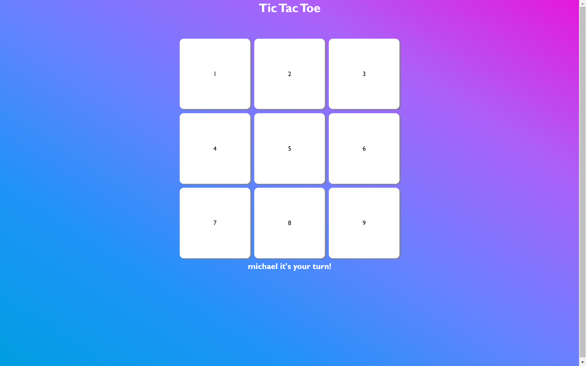

# Tic-Tac-Toe

> This is a tic-tac-toe game to get familiar with Javascript

In this application you can play a game of tic-tac-toe against your friends or foe's.

## Built With

- Javascript
- HTML
- CSS

## Live Demo

[Live Demo Link](https://mikethreels.github.io/tic_tac_toe_js/)

## Getting Started

To get a local copy up and running follow these simple example steps.

git clone https://github.com/mikethreels/tic_tac_toe_js
Open the index.html with your favorite browser
Explore the website

## About Tic Tac Toe Game

It's game in which two players alternately put Xs and Os in compartments of a figure formed by two vertical lines crossing two horizontal lines and each tries to get a row of three Xs or three Os before the opponent does.

## RULES FOR TIC-TAC-TOE

The game is played on a grid that's n squares by n squares.
You are a symbol you choose, your friend is another symbol he chooses. Players take turns putting their marks in empty squares.
The first player to get n of his/her marks in a row (horizontally, vertically, or diagonally) is the winner.
When all squares are full, the game is over. If no player has n marks in a row, the game ends in a tie.

## Testing

To run the tests created follow below steps.
- Run `npm install`
- Run `npm test`

In the current test below functions are being tested.
- gameLogic.winnerMessage
- gameLogic.winCheck
- gameLogic.drawCheck
- gameLogic.playerMove
- Player

The user can add test insid the game.test.js file inside the test folder.

## Author
👤 Michael Threels
- Github: [@mikethreels](https://github.com/mikethreels)
- Twitter: [@MichaelThreels](https://twitter.com/MichaelThreels)
- LinkedIn :[michaelthreels](https://www.linkedin.com/in/michael-threels)

👤 Carlos Prieto Barron
- Github: [@carlosprietobarron](https://github.com/carlosprietobarron)
- LinkedIn: [CarlosPrietoBarron](www.linkedin.com/in/carlosprietobarron)

## 🤝 Contributing

Contributions, issues and feature requests are welcome!

Feel free to check the [issues page](issues/).

## Show your support

Give a ⭐️ if you like this project!

## Acknowledgments

- Hat tip to anyone whose code was used
- Inspiration
- etc

## 📝 License

This project is [MIT](lic.url) licensed.
