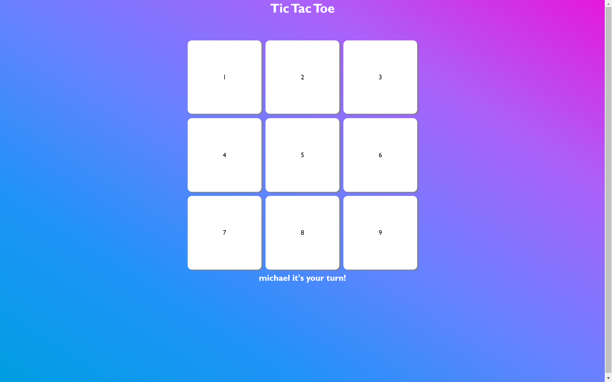

# Tic-Tac-Toe

> This is a tic-tac-toe game to get familiar with Javascript

In this application you can play a game of tic-tac-toe against your friends or foe's.

## Built With

- Javascript
- HTML
- CSS

## Live Demo

[Live Demo Link](https://mikethreels.github.io/library/)

## Getting Started

To get a local copy up and running follow these simple example steps.

git clone https://github.com/mikethreels/library
Open the index.html with your favorite browser
Explore the website

## Author
👤 Michael Threels
- Github: [@mikethreels](https://github.com/mikethreels)
- Twitter: [@MichaelThreels](https://twitter.com/MichaelThreels)
- LinkedIn :[michaelthreels](https://www.linkedin.com/in/michael-threels)

## 🤝 Contributing

Contributions, issues and feature requests are welcome!

Feel free to check the [issues page](issues/).

## Show your support

Give a ⭐️ if you like this project!

## Acknowledgments

- Hat tip to anyone whose code was used
- Inspiration
- etc

## 📝 License

This project is [MIT](lic.url) licensed.
